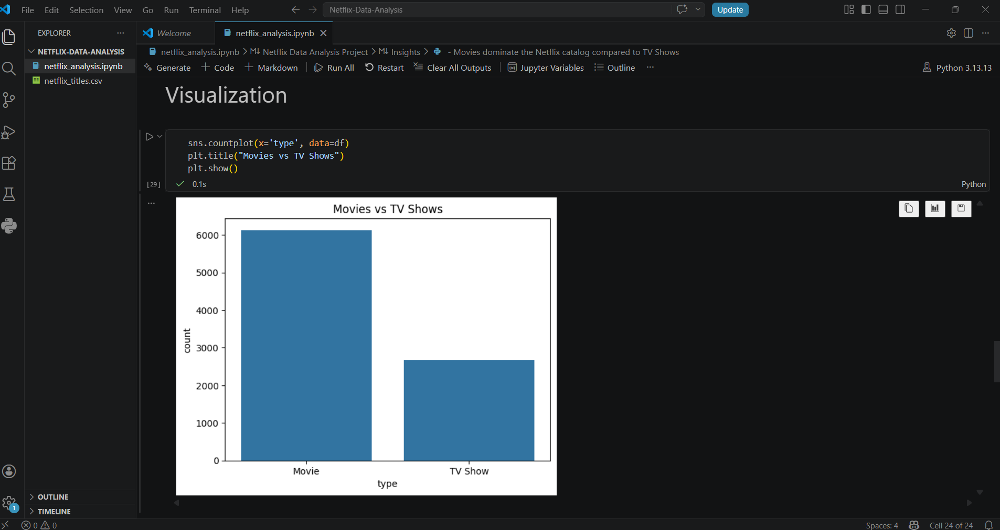
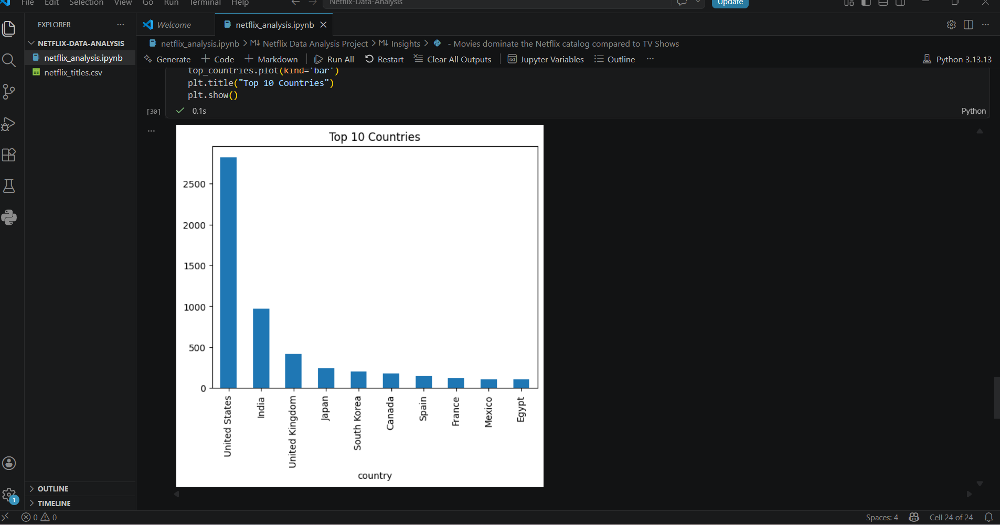
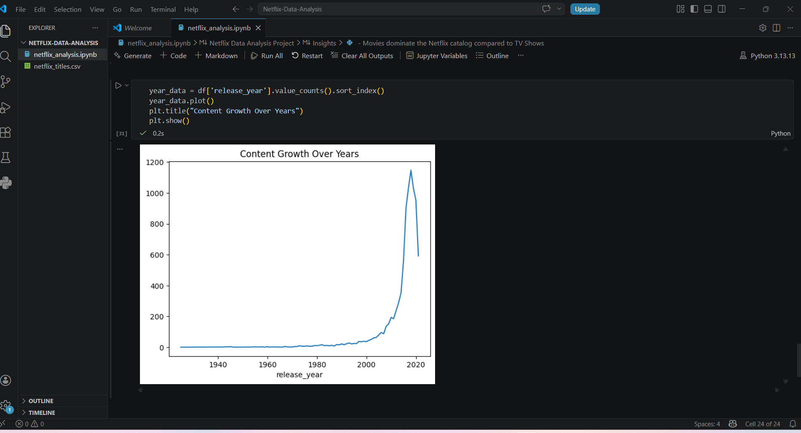

# Netflix Data Analysis

## Project Overview
This project analyzes the Netflix Movies and TV Shows dataset to uncover trends, patterns, and insights.

## Tools Used
- Python
- Pandas
- NumPy
- Matplotlib
- Seaborn

## Key Insights
- Movies dominate the Netflix catalog compared to TV Shows
- The United States is the leading contributor of content
- Content increased significantly after 2015
- Drama and International genres are popular

## Visualizations

## Dataset
Netflix Movies and TV Shows dataset
